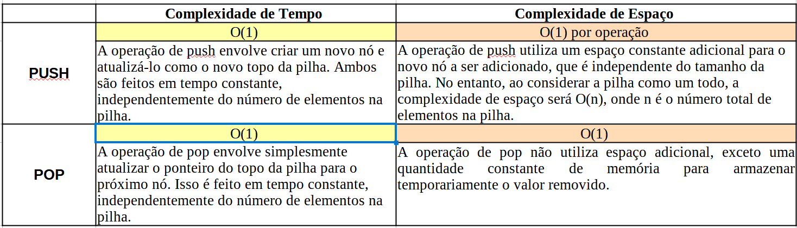
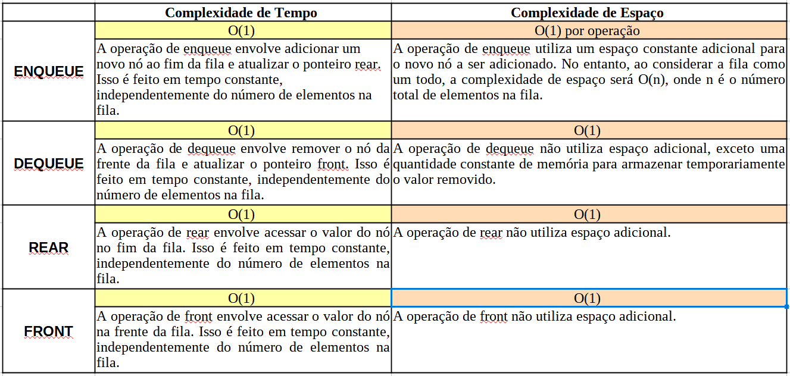
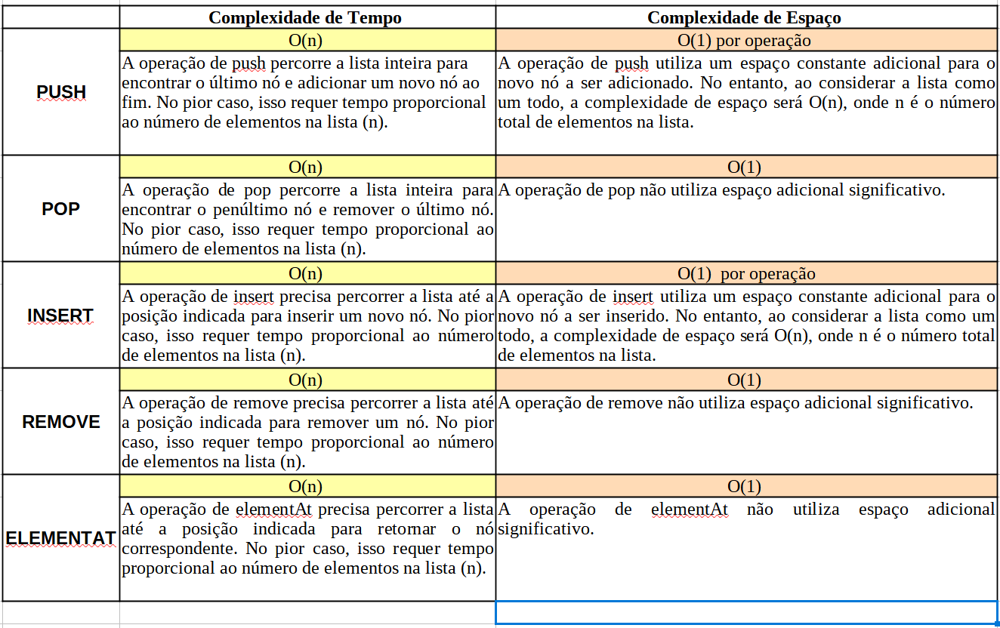
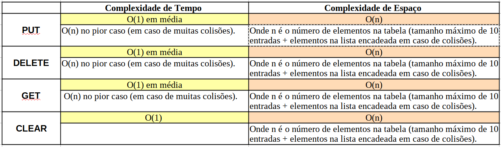

<p align="center">

</p>

# 1.7 - Calculando a eficiência em Algoritmos.

Este é um artigo criado para o curso **Profissão : Especialista Back-End JAVA** da escola **EBAC** (Parte 3 "Back-End Java Pro" - Capítulo 2 "Algoritmos").

 > 💻 **Complexidade Assintótica de Tempo e de Espaço** 
 A complexidade assintótica é uma maneira de descrever a eficiência de um algoritmo em termos de tempo de execução (complexidade de tempo) e uso de memória (complexidade de espaço), à medida que o tamanho da entrada cresce. Ela ajuda a entender como um algoritmo se comporta em termos de desempenho à medida que a entrada aumenta, ignorando constantes e termos de menor ordem. 
 > A análise da complexidade assintótica é crucial porque:
>- Comparação de Algoritmos: Permite comparar diferentes algoritmos e escolher o mais eficiente.
>- Escalabilidade: Ajuda a prever como um algoritmo se comportará com entradas grandes.
>- Otimização: Identifica pontos fracos em termos de tempo ou espaço, ajudando na otimização do algoritmo.
>
 > 💻 **Complexidade de Tempo** 
 Complexidade de tempo refere-se ao tempo que um algoritmo leva para executar em relação ao tamanho da entrada. Ela é expressa em termos da notação Big O (O(n)), onde n representa o tamanho da entrada.
>- O(1): Tempo constante. O tempo de execução não depende do tamanho da entrada.
>- O(n): Tempo linear. O tempo de execução cresce linearmente com o tamanho da entrada.
>- O(n^2): Tempo quadrático. O tempo de execução cresce quadraticamente com o tamanho da entrada.
>- O(log n): Tempo logarítmico. O tempo de execução cresce logaritimicamente com o tamanho da entrada. 
>
> 💻 **Complexidade de Espaço** 
>Complexidade de espaço refere-se à quantidade de memória que um algoritmo usa em relação ao tamanho da entrada. Ela também é expressa em termos da notação Big O.
>- O(1): Espaço constante. A quantidade de memória usada não depende do tamanho da entrada.
>- O(n): Espaço linear. A quantidade de memória usada cresce linearmente com o tamanho da entrada.
>- O(n^2): Espaço quadrático. A quantidade de memória usada cresce quadraticamente com o tamanho da entrada.
 


## ✨ Exemplos práticos
Seguem exemplos onde aplicamos o análise da complexidade assintótica, nos seguintes algoritmos : 

- [Pilha](https://pt.wikipedia.org/wiki/Pilha_(inform%C3%A1tica))
- [Fila FIFO](https://pt.wikipedia.org/wiki/FIFO)
- [Lista Encadeada](https://pt.wikipedia.org/wiki/Lista_ligada)
- [Mapa de Hash](https://joaoarthurbm.github.io/eda/posts/hashtable/)


## 🛠️ Pilha

Implementação de uma classe que representa uma estrutura tipo Pilha. Aceita somente inteiros. Inclui os seguintes métodos : 

- 🤖 Push(). Coloca um inteiro no topo da pilha.
- 🤖 pop(): Remove o valor do topo da pilha e o retorna ao chamador.
- 🤖 top(): Espia o inteiro que está no topo e o retorna sem mexer na pilha.
- 🤖 isEmpty(): Retorna true ou false dependendo da pilha estar vazia ou não.
- 🤖 size(): Retorna um valor inteiro com o número de elementos da pilha.

```java
public class CustomStack {
    private Node top;
    private int size;

    // Classe interna para representar um nó na pilha
    private class Node {
        int value;
        Node next;

        Node(int value) {
            this.value = value;
        }
    }

    // Construtor da pilha
    public CustomStack() {
        top = null;
        size = 0;
    }

    // Método para colocar um inteiro no topo da pilha
    public void push(int value) {
        Node newNode = new Node(value);
        newNode.next = top;
        top = newNode;
        size++;
    }

    // Método para remover e retornar o valor do topo da pilha
    public int pop() {
        if (isEmpty()) {
            throw new RuntimeException("Pilha vazia, não é possível remover elementos.");
        }
        int value = top.value;
        top = top.next;
        size--;
        return value;
    }

    // Método para espirar o valor do topo da pilha sem removê-lo
    public int top() {
        if (isEmpty()) {
            throw new RuntimeException("Pilha vazia, não é possível espirar elementos.");
        }
        return top.value;
    }

    // Método para verificar se a pilha está vazia
    public boolean isEmpty() {
        return top == null;
    }

    // Método para retornar o número de elementos na pilha
    public int size() {
        return size;
    }

    public static void main(String[] args) {
        CustomStack stack = new CustomStack();

        stack.push(10);
        stack.push(20);
        stack.push(30);

        System.out.println("Top element: " + stack.top()); // 30
        System.out.println("Stack size: " + stack.size()); // 3

        System.out.println("Popped element: " + stack.pop()); // 30
        System.out.println("Top element after pop: " + stack.top()); // 20
        System.out.println("Stack size after pop: " + stack.size()); // 2

        System.out.println("Is stack empty? " + stack.isEmpty()); // false

        stack.pop();
        stack.pop();

        System.out.println("Is stack empty after popping all elements? " + stack.isEmpty()); // true
    }
}

```

#### Explicação.
- [X] Classe CustomStack: A classe principal que representa a pilha.
- [X] Classe interna Node: Representa um nó na pilha, contendo um valor inteiro e uma referência para o próximo nó.
- [X] Construtor CustomStack: Inicializa a pilha com top como null e size como 0.
- [X] Método push(int value): Adiciona um novo valor ao topo da pilha.
- [X] Método pop(): Remove e retorna o valor do topo da pilha, lançando uma exceção se a pilha estiver vazia.
- [X] Método top(): Retorna o valor do topo da pilha sem removê-lo, lançando uma exceção se a pilha estiver vazia.
- [X] Método isEmpty(): Verifica se a pilha está vazia.
- [X] Método size(): Retorna o número de elementos na pilha.
- [X] O método main fornece um exemplo de como usar a classe CustomStack.

#### Complexidade Assintótica de Tempo e Espaço.
<p align="center">

</p> 


## 🛠️ Fila Fifo

Implementação de uma classe que representa uma estrutura tipo Fila FIFO. Aceita somente inteiros. Inclui os seguintes métodos : 

- 🤖 Enqueue(). Adiciona um inteiro à fila.
- 🤖 Dequeue(): Remove um inteiro da fila.
- 🤖 Rear(): Retorna o inteiro que está no fim da fila.
- 🤖 Front(): Retorna o inteiro que está na frente da fila.
- 🤖 Size(): Retorna o tamanho da fila.
- 🤖 IsEmpty(): Retorna True ou False dependendo da fila estar vazia ou não.

```java
public class CustomQueue {
    private Node front;
    private Node rear;
    private int size;

    // Classe interna para representar um nó na fila
    private class Node {
        int value;
        Node next;

        Node(int value) {
            this.value = value;
        }
    }

    // Construtor da fila
    public CustomQueue() {
        front = null;
        rear = null;
        size = 0;
    }

    // Método para adicionar um inteiro à fila
    public void enqueue(int value) {
        Node newNode = new Node(value);
        if (isEmpty()) {
            front = newNode;
            rear = newNode;
        } else {
            rear.next = newNode;
            rear = newNode;
        }
        size++;
    }

    // Método para remover e retornar o inteiro da frente da fila
    public int dequeue() {
        if (isEmpty()) {
            throw new RuntimeException("Fila vazia, não é possível remover elementos.");
        }
        int value = front.value;
        front = front.next;
        if (front == null) {
            rear = null;
        }
        size--;
        return value;
    }

    // Método para retornar o inteiro que está no fim da fila
    public int last() {
        if (isEmpty()) {
            throw new RuntimeException("Fila vazia, não é possível obter o último elemento.");
        }
        return rear.value;
    }

    // Método para retornar o inteiro que está na frente da fila
    public int front() {
        if (isEmpty()) {
            throw new RuntimeException("Fila vazia, não é possível obter o primeiro elemento.");
        }
        return front.value;
    }

    // Método para retornar o tamanho da fila
    public int size() {
        return size;
    }

    // Método para verificar se a fila está vazia
    public boolean isEmpty() {
        return front == null;
    }

    public static void main(String[] args) {
        CustomQueue queue = new CustomQueue();

        queue.enqueue(10);
        queue.enqueue(20);
        queue.enqueue(30);

        System.out.println("Front element: " + queue.front()); // 10
        System.out.println("Last element: " + queue.last()); // 30
        System.out.println("Queue size: " + queue.size()); // 3

        System.out.println("Dequeued element: " + queue.dequeue()); // 10
        System.out.println("Front element after dequeue: " + queue.front()); // 20
        System.out.println("Queue size after dequeue: " + queue.size()); // 2

        System.out.println("Is queue empty? " + queue.isEmpty()); // false

        queue.dequeue();
        queue.dequeue();

        System.out.println("Is queue empty after dequeuing all elements? " + queue.isEmpty()); // true
    }
}

```

#### Explicação.
- [X] Classe CustomQueue: A classe principal que representa a fila.
- [X] Classe interna Node: Representa um nó na fila, contendo um valor inteiro e uma referência para o próximo nó.
- [X] Construtor CustomQueue: Inicializa a fila com front e rear como null e size como 0.
- [X] Método enqueue(int value): Adiciona um novo valor ao fim da fila.
- [X] Método dequeue(): Remove e retorna o valor da frente da fila, lançando uma exceção se a fila estiver vazia.
- [X] Método last(): Retorna o valor do fim da fila, lançando uma exceção se a fila estiver vazia.
- [X] Método front(): Retorna o valor da frente da fila, lançando uma exceção se a fila estiver vazia.
- [X] Método size(): Retorna o número de elementos na fila.
- [X] Método isEmpty(): Verifica se a fila está vazia.
- [X] O método main fornece um exemplo de como usar a classe CustomQueue.

#### Complexidade Assintótica de Tempo e Espaço.
<p align="center">

</p> 


## 🛠️ Lista encadeada

Implementação de uma classe que representa uma estrutura tipo Lista Encadeada. Aceita somente inteiros. Inclui os seguintes métodos : 

- 🤖 Push(). Adiciona o nó ao fim da lista.
- 🤖 Pop(): Remove o nó no fim da lista e retorna o mesmo.
- 🤖 Insert(): Adiciona um nó na posição da lista indicada via parâmetro.
- 🤖 Remove(): Remove um nó na posição da lista indicada via parâmetro.
- 🤖 ElementAt(): Retorna o elemento que está no índice da lista indicada via parâmetro.
- 🤖 Size(): Retorna o tamanho da lista.
- 🤖 PrintList(): Retorna uma representação em texto da lista.

```java
public class CustomLinkedList {
    private Node head;
    private int size;

    // Classe interna para representar um nó na lista
    public static class Node {
        int value;
        Node next;

        Node(int value) {
            this.value = value;
            this.next = null;
        }
    }

    // Construtor da lista encadeada
    public CustomLinkedList() {
        head = null;
        size = 0;
    }

    // Método para adicionar um nó ao fim da lista
    public void push(Node node) {
        if (head == null) {
            head = node;
        } else {
            Node current = head;
            while (current.next != null) {
                current = current.next;
            }
            current.next = node;
        }
        size++;
    }

    // Método para remover e retornar o nó no fim da lista
    public Node pop() {
        if (head == null) {
            throw new RuntimeException("Lista vazia, não é possível remover elementos.");
        }

        if (head.next == null) {
            Node node = head;
            head = null;
            size--;
            return node;
        }

        Node current = head;
        while (current.next.next != null) {
            current = current.next;
        }
        Node node = current.next;
        current.next = null;
        size--;
        return node;
    }

    // Método para adicionar um nó na posição indicada
    public void insert(int index, Node node) {
        if (index < 0 || index > size) {
            throw new IndexOutOfBoundsException("Índice fora dos limites.");
        }

        if (index == 0) {
            node.next = head;
            head = node;
        } else {
            Node current = head;
            for (int i = 0; i < index - 1; i++) {
                current = current.next;
            }
            node.next = current.next;
            current.next = node;
        }
        size++;
    }

    // Método para remover um nó na posição indicada
    public void remove(int index) {
        if (index < 0 || index >= size) {
            throw new IndexOutOfBoundsException("Índice fora dos limites.");
        }

        if (index == 0) {
            head = head.next;
        } else {
            Node current = head;
            for (int i = 0; i < index - 1; i++) {
                current = current.next;
            }
            current.next = current.next.next;
        }
        size--;
    }

    // Método para retornar o nó na posição indicada
    public Node elementAt(int index) {
        if (index < 0 || index >= size) {
            throw new IndexOutOfBoundsException("Índice fora dos limites.");
        }

        Node current = head;
        for (int i = 0; i < index; i++) {
            current = current.next;
        }
        return current;
    }

    // Método para retornar o tamanho da lista
    public int size() {
        return size;
    }

    // Método para retornar uma representação em texto da lista
    public void printList() {
        Node current = head;
        while (current != null) {
            System.out.print(current.value + " -> ");
            current = current.next;
        }
        System.out.println("null");
    }

    public static void main(String[] args) {
        CustomLinkedList list = new CustomLinkedList();

        list.push(new Node(10));
        list.push(new Node(20));
        list.push(new Node(30));

        System.out.println("Lista inicial:");
        list.printList(); // 10 -> 20 -> 30 -> null

        list.insert(1, new Node(15));
        System.out.println("Depois de inserir 15 na posição 1:");
        list.printList(); // 10 -> 15 -> 20 -> 30 -> null

        list.remove(2);
        System.out.println("Depois de remover o elemento na posição 2:");
        list.printList(); // 10 -> 15 -> 30 -> null

        System.out.println("Elemento na posição 1: " + list.elementAt(1).value); // 15
        System.out.println("Tamanho da lista: " + list.size()); // 3

        System.out.println("Elemento removido do final: " + list.pop().value); // 30
        System.out.println("Lista depois de remover o último elemento:");
        list.printList(); // 10 -> 15 -> null
    }
}

```

#### Explicação.
- [X] Classe CustomLinkedList: A classe principal que representa a lista encadeada.
- [X] Classe interna Node: Representa um nó na lista, contendo um valor inteiro e uma referência para o próximo nó.
- [X] Construtor CustomLinkedList: Inicializa a lista encadeada com head como null e size como 0.
- [X] Método push(Node node): Adiciona um novo nó ao fim da lista.
- [X] Método pop(): Remove e retorna o nó no fim da lista, lançando uma exceção se a lista estiver vazia.
- [X] Método insert(int index, Node node): Adiciona um nó na posição indicada na lista.
- [X] Método remove(int index): Remove o nó na posição indicada na lista, lançando uma exceção se o índice estiver fora dos limites.
- [X] Método elementAt(int index): Retorna o nó na posição indicada na lista, lançando uma exceção se o índice estiver fora dos limites.
- [X] Método size(): Retorna o número de elementos na lista.
- [X] Método printList(): Imprime uma representação textual da lista.

#### Complexidade Assintótica de Tempo e Espaço.
<p align="center">

</p> 


## 🛠️ Mapa de Hash

Implementação de uma classe que representa uma estrutura tipo Mapa de Hash. Aceita somente inteiros (chave,valor) e terá tamanho fixo de 10 elementos. Inclui os seguintes métodos : 

- 🤖 Put(). Adiciona o par (chave,valor) ao mapa.
- 🤖 Delete(): Remove o valor do topo da pilha e o retorna ao chamador.
- 🤖 Get(): Retorna o valor associado à chave passada via parâmetro.
- 🤖 Clear(): Remove todos os elementos do mapa.

```java
public class CustomHashMap {
    private static final int SIZE = 10;
    private Entry[] table;

    public CustomHashMap() {
        table = new Entry[SIZE];
    }

    // Classe interna para representar uma entrada no mapa
    private static class Entry {
        int key;
        int value;
        Entry next;

        Entry(int key, int value) {
            this.key = key;
            this.value = value;
            this.next = null;
        }
    }

    // Método para adicionar um par chave/valor ao mapa
    public void put(int key, int value) {
        int index = hash(key);
        Entry newEntry = new Entry(key, value);
        
        if (table[index] == null) {
            table[index] = newEntry;
        } else {
            Entry current = table[index];
            Entry prev = null;
            while (current != null) {
                if (current.key == key) {
                    current.value = value;
                    return;
                }
                prev = current;
                current = current.next;
            }
            prev.next = newEntry;
        }
    }

    // Método para remover um par chave/valor do mapa
    public int delete(int key) {
        int index = hash(key);
        Entry current = table[index];
        Entry prev = null;

        while (current != null) {
            if (current.key == key) {
                if (prev == null) {
                    table[index] = current.next;
                } else {
                    prev.next = current.next;
                }
                return current.value;
            }
            prev = current;
            current = current.next;
        }

        throw new RuntimeException("Chave não encontrada: " + key);
    }

    // Método para obter o valor associado a uma chave
    public int get(int key) {
        int index = hash(key);
        Entry current = table[index];

        while (current != null) {
            if (current.key == key) {
                return current.value;
            }
            current = current.next;
        }

        throw new RuntimeException("Chave não encontrada: " + key);
    }

    // Método para remover todos os elementos do mapa
    public void clear() {
        table = new Entry[SIZE];
    }

    // Função hash simples
    private int hash(int key) {
        return key % SIZE;
    }

    public static void main(String[] args) {
        CustomHashMap map = new CustomHashMap();

        map.put(1, 100);
        map.put(2, 200);
        map.put(12, 1200); // Colisão com a chave 2

        System.out.println("Valor da chave 1: " + map.get(1)); // 100
        System.out.println("Valor da chave 2: " + map.get(2)); // 200
        System.out.println("Valor da chave 12: " + map.get(12)); // 1200

        map.delete(2);
        System.out.println("Valor da chave 12 após deletar chave 2: " + map.get(12)); // 1200

        map.clear();
        try {
            System.out.println("Valor da chave 1 após clear: " + map.get(1)); // Deve lançar exceção
        } catch (RuntimeException e) {
            System.out.println(e.getMessage()); // Chave não encontrada: 1
        }
    }
}

```

#### Explicação.
- [X] Classe CustomHashMap: A classe principal que representa o mapa de hash.
- [X] Classe interna Entry: Representa um par chave/valor no mapa, incluindo uma referência para o próximo Entry na lista encadeada (para tratar colisões).
- [X] Construtor CustomHashMap: Inicializa a tabela de hash com um tamanho fixo de 10 elementos.
- [X] Método put(int key, int value): Adiciona um novo par chave/valor ao mapa. Se a chave já existir, atualiza o valor associado.
- [X] Método delete(int key): Remove o par chave/valor do mapa e retorna o valor associado à chave removida.
- [X] Método get(int key): Retorna o valor associado à chave passada como parâmetro.
- [X] Método clear(): Remove todos os elementos do mapa, redefinindo a tabela de hash.
- [X] Função hash(int key): Função hash simples que calcula o índice a partir da chave usando a operação módulo (key % SIZE).

#### Complexidade Assintótica de Tempo e Espaço.
<p align="center">

</p> 


## 👨‍💻 Autor

<p>
    
    <p>&nbsp&nbsp&nbspRamiro Zavala<br>
    &nbsp&nbsp&nbsp
    <a 
        href="https://github.com/ramiro-ebac-2022/">
        GitHub
    </a>
    &nbsp;|&nbsp;
    <a 
        href="https://www.linkedin.com/in/ramiro-arce/">
        LinkedIn
    </a>
    &nbsp;|&nbsp;
</p>
</p>
<br/><br/>
<p>

---
